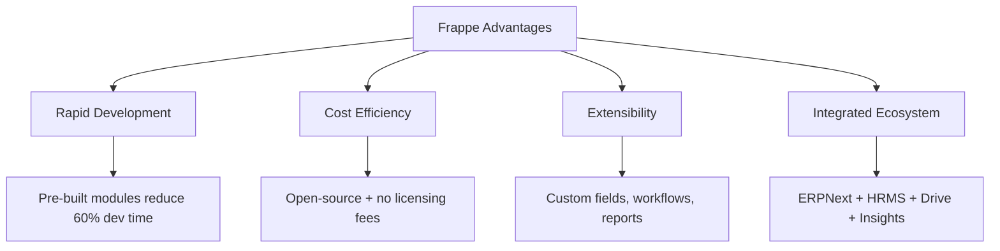
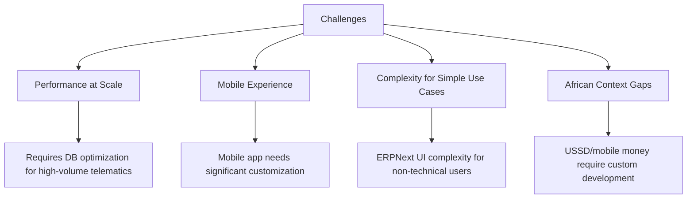
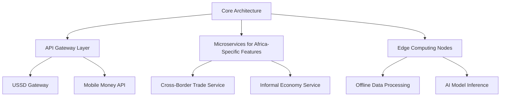

## Frappe Framework for TEMS Platform Implementation

### 1. Feasibility Assessment

**Frappe Framework is a STRONGLY SUITABLE choice for TEMS** with these critical alignments:

| **PRD Requirement**        | **Frappe Capability**                                 | **Feasibility Rating** |
| -------------------------- | ----------------------------------------------------- | ---------------------- |
| Multi-tenant SaaS          | Native multi-tenancy with site-based isolation        | ★★★★★                  |
| Offline-first architecture | Frappe's offline sync engine with conflict resolution | ★★★★☆                  |
| Rapid development          | Framework + pre-built modules (ERPNext, HRMS)         | ★★★★★                  |
| Mobile responsiveness      | Mobile framework + PWA capabilities                   | ★★★★☆                  |
| Custom workflow engine     | Built-in workflow builder with Python scripting       | ★★★★★                  |
| API-first architecture     | RESTful APIs + WebSocket support                      | ★★★★★                  |
| Document management        | Frappe Drive integration                              | ★★★★★                  |

**Critical Considerations for African Context:**
- **USSD Integration**: Requires custom middleware (Frappe's API layer supports this)
- **Mobile Money**: Needs custom connectors (Frappe's payment gateway framework accommodates)
- **Sparse Data AI**: Frappe's Python backend supports ML libraries but requires optimization
- **Low-Bandwidth Mode**: Possible through custom middleware and data compression

### 2. Pros and Cons Analysis

#### **Major Advantages**


#### **Significant Challenges**


### 3. User Experience Strategy for Non-Technical Users

**Critical UX Adaptations Required:**

#### **Interface Simplification**
```python
# Example: Custom UI Layer Implementation
class SimplifiedFrappeUI:
    def __init__(self):
        self.hide_advanced_features = True
        self.role_based_views = {
            'driver': ['trips', 'incidents', 'earnings'],
            'fleet_manager': ['vehicles', 'maintenance', 'utilization']
        }
    
    def create_dashboard(self, user_role):
        return self.generate_role_specific_widgets(user_role)
```

#### **Key UX Enhancements**
1. **Progressive Disclosure**: Show only essential features first
2. **Voice Interface Integration**: For low-literacy users
3. **Visual Workflow Guides**: Step-by-step process flows
4. **Offline-First Mobile App**: Simplified version of core features
5. **USSD Menu Optimization**: Logical menu trees for feature phones
6. **Contextual Help**: In-app guidance in local languages

#### **Training & Onboarding**
- **Interactive Tutorials**: Scenario-based learning
- **Video Guides**: Low-bandwidth optimized
- **Community Training**: Train-the-trainer model for cooperatives
- **SMS/USSD Support**: Basic help via text channels

### 4. Critical Architectural & Design Decisions

#### **Tier 1: Foundational Decisions (Make Immediately)**

| Decision Area            | Recommendation                                    | Rationale                                           |
| ------------------------ | ------------------------------------------------- | --------------------------------------------------- |
| **Multi-tenancy Model**  | Shared DB with Site-based isolation               | Balances performance & isolation for African market |
| **Offline Architecture** | Frappe's sync engine + custom conflict resolution | Handles intermittent connectivity                   |
| **Mobile Strategy**      | Custom PWA + native Android app                   | Covers smartphone & basic phone users               |
| **Data Localization**    | Country-specific DB instances                     | Addresses regulatory requirements                   |

#### **Tier 2: Technical Architecture Decisions**



#### **Tier 3: Implementation Priorities**

1. **Phase 0 (Weeks 1-4)**: Core Setup
   - Multi-tenant Frappe instance
   - Custom mobile money connector
   - USSD gateway integration
   - Offline sync optimization

2. **Phase 1 (Weeks 5-12)**: MVP Launch
   - Fleet management module
   - Driver management
   - Basic safety reporting
   - Mobile app (Android first)

3. **Phase 2 (Weeks 13-20)**: Market Expansion
   - Country-specific localization
   - Cross-border features
   - Informal economy integration
   - Performance optimization

#### **Critical Success Factors**

1. **Performance Optimization**
   ```python
   # Example: Telematics Data Handling
   class TelematicsDataHandler:
       def __init__(self):
           self.batch_size = 1000  # Process in batches
           self.compression = True  # Enable data compression
           self.edge_processing = True  # Process at edge when possible
       
       def process_vehicle_data(self, raw_data):
           return self.compress_and_batch(raw_data)
   ```

2. **Integration Architecture**
   ```mermaid
   graph LR
       A[External Systems] --> B[API Gateway]
       B --> C[Frappe Backend]
       C --> D[Custom Services]
       D --> E[Mobile Money APIs]
       D --> F[USSD Gateways]
       D --> G[Telematics Providers]
       D --> H[Government Systems]
   ```

3. **Scalability Considerations**
   - **Database**: Implement read replicas for high-volume reporting
   - **Caching**: Redis for frequently accessed data (routes, tariffs)
   - **CDN**: Static asset delivery for low-bandwidth regions
   - **Queue System**: Celery + Redis for background processing

### Final Recommendation

**Frappe is an excellent choice for TEMS** with these critical success factors:

1. **Leverage Frappe's strengths**: Rapid development, integrated modules, workflow engine
2. **Mitigate weaknesses**: Invest in custom mobile layer, performance optimization, and UX simplification
3. **African context first**: Prioritize USSD, mobile money, and offline capabilities from day one
4. **Phased rollout**: Start with 1-2 countries to refine localization before expansion
5. **Community engagement**: Involve local transport operators in co-creation process

**Estimated Timeline**: MVP in 4 months, full feature set in 12 months with proper resource allocation.

The framework's flexibility and integrated ecosystem provide a solid foundation, but success depends heavily on thoughtful customization for the African market's unique infrastructure and user needs.