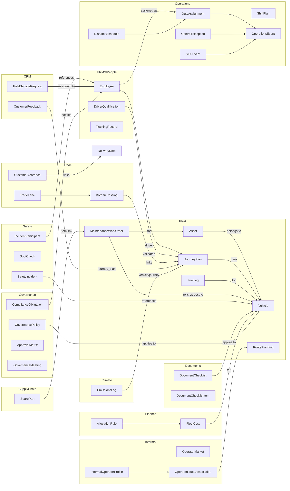

# TEMS Module Map

This map outlines dependencies and integration flows across TEMS modules on Frappe v15+. Each module should live under the `tems` app, extend ERPNext/HRMS where needed, and expose fixtures for roles/workspaces.

## Domains and Key Dependencies

- Governance
  - Depends on: Documents, Insights
  - Provides: Policy, Compliance Audit, SLA standards

- People (HRMS)
  - Depends on: HRMS Employee, Training
  - Provides: Driver Qualification, Training Records, Performance Reviews
  - Used by: Operations (assignment), Safety (eligibility), Finance (payroll links)

# TEMS Module Map — Inter-Domain Dependencies

This map reflects current implemented DocTypes and the 13 domains. Vehicle is the operational nucleus; Assets roll up to Vehicle.

Notes
- Shapes are conceptual; refer to domain packages under `tems/tems_*` for exact DocType names and paths.
- All operations and costing ultimately reference Vehicle, with asset-level drill-down for traceability.
