# TEMS Full Entity Relationship Diagram (ERD)

This document provides a comprehensive ERD for TEMS across 12 domains plus the Operations hub. It extends the sample in `doc/TEMS_ERD.md` and maps to current/custom DocTypes under `apps/tems/tems/tems/doctype` where applicable.

```mermaid
erDiagram

    %% Operations Hub (Execution Core)
    OPERATIONS ||--o{ JOURNEY_PLAN : executes
    OPERATIONS ||--o{ VEHICLE_TRIP : tracks
    OPERATIONS ||--o{ ROUTE_PLANNING : optimizes
    OPERATIONS ||--o{ WAY_POINTS : navigates
    OPERATIONS ||--o{ MOVEMENT_LOG : logs
    OPERATIONS ||--o{ COST_REVENUE_LEDGER : posts

    %% HRMS / People
    HRMS ||--o{ EMPLOYEE : manages
    EMPLOYEE ||--o{ DRIVER_QUALIFICATION : has
    EMPLOYEE ||--o{ TRAINING_RECORD : attends
    EMPLOYEE ||--o{ PERFORMANCE_REVIEW : reviewed_in
    OPERATIONS ||--o{ EMPLOYEE : assigns

    %% Fleet
    FLEET ||--o{ VEHICLE : manages
    VEHICLE ||--o{ MAINTENANCE_WORK_ORDER : serviced_by
    VEHICLE ||--o{ EMISSION_LOG : emits
    OPERATIONS ||--o{ VEHICLE : allocates

    %% Safety
    SAFETY ||--o{ JOURNEY_PLAN : prepares
    SAFETY ||--o{ INCIDENT_REPORT : records
    SAFETY ||--o{ RISK_ASSESSMENT : evaluates
    OPERATIONS ||--o{ JOURNEY_PLAN : enforces
    OPERATIONS ||--o{ CUSTOM_CHECKPOINT : verifies

    %% Finance
    FINANCE ||--o{ JOURNEY_COSTING : captures
    FINANCE ||--o{ FX_RISK_LOG : manages
    OPERATIONS ||--o{ COST_REVENUE_LEDGER : integrates

    %% CRM
    CRM ||--o{ CUSTOMER : manages
    CUSTOMER ||--o{ ORDER : places
    CRM ||--o{ SLA_LOG : tracks
    OPERATIONS ||--o{ ORDER : fulfills

    %% Supply Chain
    SUPPLY_CHAIN ||--o{ SUPPLIER : manages
    SUPPLIER ||--o{ PROCUREMENT_ORDER : fulfills
    SUPPLY_CHAIN ||--o{ INVENTORY_ITEM : maintains
    OPERATIONS ||--o{ INVENTORY_ITEM : consumes

    %% Trade / Cross-border
    TRADE ||--o{ BORDER_CROSSING : requires
    TRADE ||--o{ FX_TRANSACTION : incurs
    OPERATIONS ||--o{ BORDER_CROSSING : executes

    %% Informal Economy
    INFORMAL ||--o{ TRIP_MATCH : participates
    INFORMAL ||--o{ SAVINGS_GROUP : joins
    INFORMAL ||--o{ LOAN : accesses
    OPERATIONS ||--o{ TRIP_MATCH : integrates

    %% Climate & ESG
    CLIMATE ||--o{ CLIMATE_ALERT : issues
    CLIMATE ||--o{ RENEWABLE_ASSET : manages
    VEHICLE ||--o{ EMISSION_LOG : contributes
    OPERATIONS ||--o{ CLIMATE_ALERT : adjusts

    %% Governance & Policy
    GOVERNANCE ||--o{ POLICY : defines
    GOVERNANCE ||--o{ COMPLIANCE_AUDIT : oversees
    OPERATIONS ||--o{ POLICY : enforces

    %% Documents (Drive) & Compliance
    DOCUMENTS ||--o{ COMPLIANCE_DOCUMENT : stores
    DOCUMENTS ||--o{ POLICY_DOCUMENT : holds
    OPERATIONS ||--o{ COMPLIANCE_DOCUMENT : references

    %% Insights (Analytics)
    INSIGHTS ||--o{ KPI_CONFIG : aggregates
    INSIGHTS ||--o{ DASHBOARD : visualizes
    INSIGHTS ||--o{ REPORT_SUBSCRIPTION : automates
    OPERATIONS ||--o{ KPI_CONFIG : feeds

    %% TEMS Custom Doctypes (current codebase)
    ROUTE_PLANNING ||--o{ WAY_POINTS : contains
    OPERATING_AREA ||--o{ ROUTE_PLANNING : includes
    VEHICLE_TRIP ||--o{ WAY_POINTS : traverses
    VEHICLE_TRIP ||--o{ VERIFICATION_DOCUMENTS : attaches
    VEHICLE_TRIP ||--o{ CUSTOM_CHECKPOINT : passes

```

Notes

- Entities in ALL_CAPS represent domain aggregates; CamelCase entities map to DocTypes (core ERPNext/HRMS or TEMS custom).
- Current TEMS custom DocTypes referenced: `vehicle_trip`, `route_planning`, `way_points`, `operating_area`, `verification_documents`, `custom_checkpoint`.
- HRMS/ERPNext links are logical and should be implemented via Link fields (e.g., Vehicle Trip → Employee (Driver), Vehicle Trip → Asset (Vehicle)).
