# TEMS Full Entity Relationship Diagram (ERD)

This ERD covers 13 domains with Vehicle as the operational nucleus. It reflects DocTypes already implemented under `apps/tems/tems/tems_{domain}` and core ERPNext/HRMS links.

```mermaid
erDiagram

    %% Operations Hub (Execution Core)
    OPERATIONS ||--o{ JOURNEY_PLAN : executes
    OPERATIONS ||--o{ DUTY_ASSIGNMENT : assigns
    OPERATIONS ||--o{ DISPATCH_SCHEDULE : plans
    OPERATIONS ||--o{ OPERATIONS_EVENT : logs
    OPERATIONS ||--o{ CONTROL_EXCEPTION : escalates
    OPERATIONS ||--o{ SOS_EVENT : alerts

    %% HRMS / People
    HRMS ||--o{ EMPLOYEE : manages
    EMPLOYEE ||--o{ DRIVER_QUALIFICATION : has
    EMPLOYEE ||--o{ TRAINING_RECORD : attends
    EMPLOYEE ||--o{ INCIDENT_INVOLVEMENT : may_participate
    OPERATIONS ||--o{ EMPLOYEE : assigns

    %% Fleet
    FLEET ||--o{ VEHICLE : manages
    VEHICLE ||--o{ MAINTENANCE_WORK_ORDER : serviced_by
    VEHICLE ||--o{ FUEL_LOG : consumes
    VEHICLE ||--o{ EMISSIONS_LOG : emits
    OPERATIONS ||--o{ VEHICLE : allocates

    %% Safety
    SAFETY ||--o{ JOURNEY_PLAN : prepares
    SAFETY ||--o{ SAFETY_INCIDENT : records
    SAFETY ||--o{ RISK_ASSESSMENT : evaluates
    OPERATIONS ||--o{ JOURNEY_PLAN : enforces

    %% Finance
    FINANCE ||--o{ FLEET_COST : captures
    FINANCE ||--o{ ALLOCATION_RULE : allocates

    %% CRM
    CRM ||--o{ CUSTOMER : manages
    CUSTOMER ||--o{ FIELD_SERVICE_REQUEST : raises
    CUSTOMER ||--o{ CUSTOMER_FEEDBACK : submits

    %% Supply Chain
    SUPPLY_CHAIN ||--o{ SPARE_PART : catalogs

    %% Trade / Cross-border
    TRADE ||--o{ TRADE_LANE : defines
    TRADE ||--o{ BORDER_CROSSING : requires
    TRADE ||--o{ CUSTOMS_CLEARANCE : processes
    OPERATIONS ||--o{ BORDER_CROSSING : executes

    %% Informal Economy
    INFORMAL ||--o{ INFORMAL_OPERATOR_PROFILE : profiles
    INFORMAL ||--o{ OPERATOR_ROUTE_ASSOCIATION : joins

    %% Climate & ESG
    CLIMATE ||--o{ EMISSIONS_LOG : aggregates
    VEHICLE ||--o{ EMISSIONS_LOG : contributes

    %% Governance & Policy
    GOVERNANCE ||--o{ GOVERNANCE_POLICY : defines
    GOVERNANCE ||--o{ COMPLIANCE_OBLIGATION : oversees
    GOVERNANCE ||--o{ GOVERNANCE_MEETING : convenes
    OPERATIONS ||--o{ GOVERNANCE_POLICY : enforces

    %% Documents (Drive) & Compliance
    DOCUMENTS ||--o{ DOCUMENT_CHECKLIST : stores
    DOCUMENTS ||--o{ VERIFICATION_DOCUMENT : holds
    OPERATIONS ||--o{ VERIFICATION_DOCUMENT : references

    %% Insights (Analytics)
    INSIGHTS ||--o{ KPI_CONFIG : aggregates
    INSIGHTS ||--o{ DASHBOARD : visualizes
    INSIGHTS ||--o{ REPORT_SUBSCRIPTION : automates

    %% TEMS Custom Doctypes (implemented)
    ROUTE_PLANNING ||--o{ JOURNEY_PLAN : plans
    JOURNEY_PLAN ||--o{ DUTY_ASSIGNMENT : schedules
    JOURNEY_PLAN ||--o{ OPERATIONS_EVENT : logs
    JOURNEY_PLAN ||--o{ BORDER_CROSSING : may_cross
    MAINTENANCE_WORK_ORDER ||--o{ SPARE_PART : consumes

```

Notes

- Entities in ALL_CAPS represent domain aggregates; CamelCase entities map to DocTypes (core ERPNext/HRMS or TEMS custom).
- Current TEMS custom DocTypes referenced include: Journey Plan, Dispatch Schedule, Duty Assignment, Operations Event, Control Exception, SOS Event, Fuel Log, Maintenance Work Order, Emissions Log, Governance Policy, Compliance Obligation, Governance Meeting, Approval Matrix, Border Crossing, Customs Clearance, Trade Lane, Document Checklist, Spare Part, Fleet Cost, Allocation Rule, Field Service Request, Customer Feedback, Informal Operator Profile, Operator Route Association.
- HRMS/ERPNext links are implemented via Link fields (e.g., Journey Plan → Employee (Driver), Journey Plan → Vehicle; Fuel Log → Vehicle).
