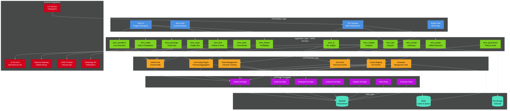
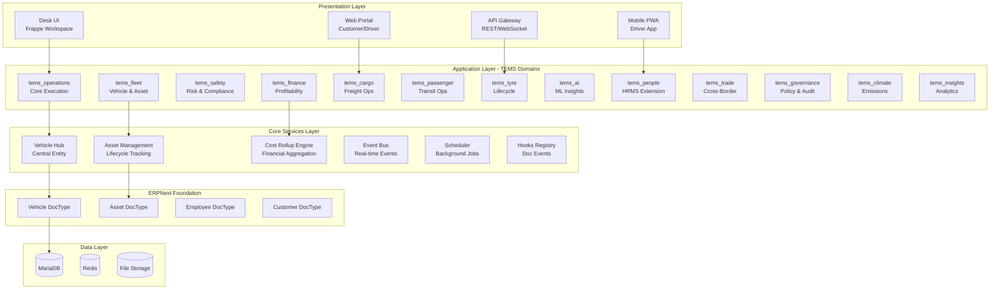
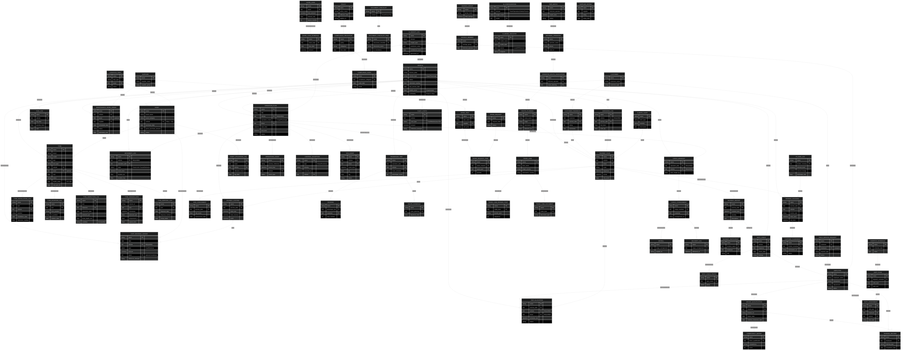
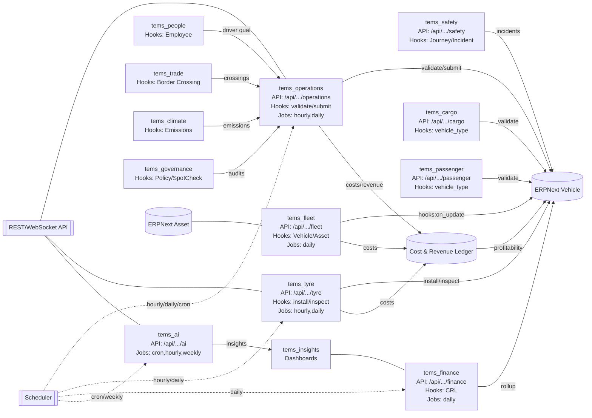
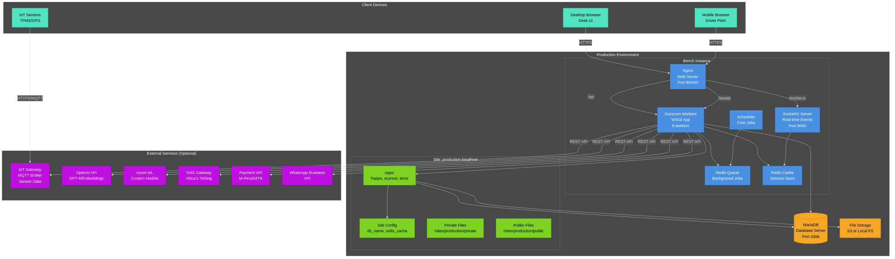
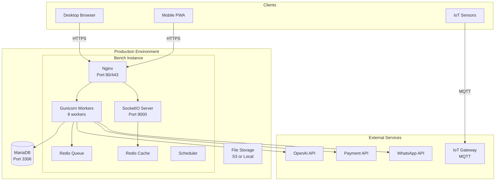
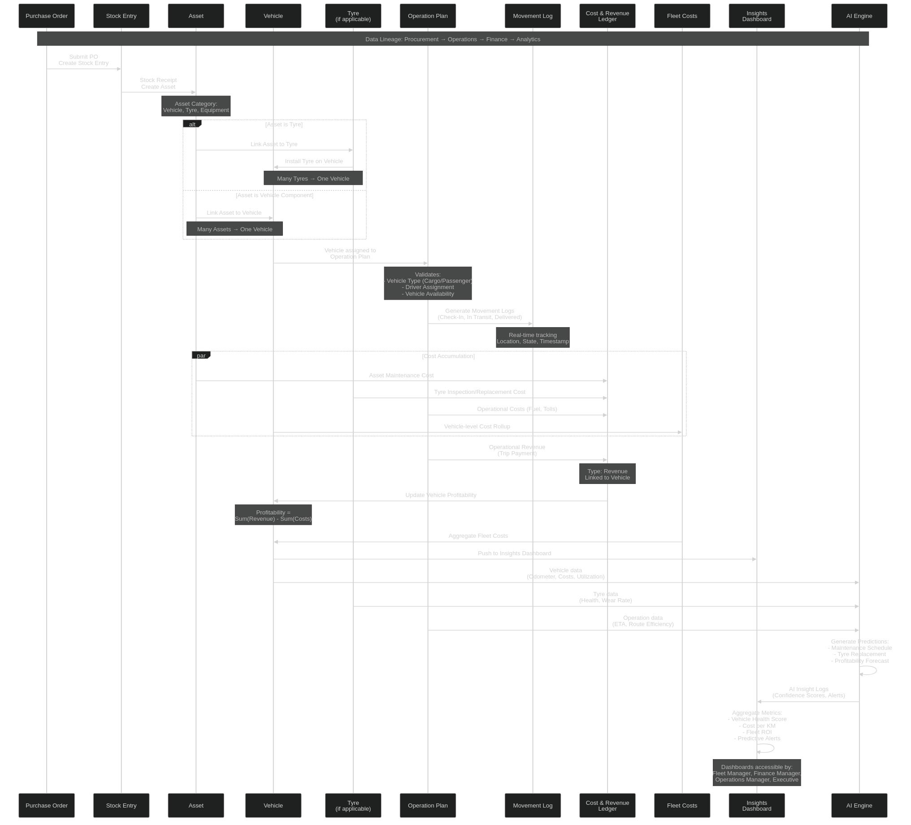

<!-- 
    TEMS Architecture Documentation
    Generated by AI Architect Agent - October 16, 2025
    This file was AI-generated and must be reviewed by technical leads
-->

# TEMS Architecture Documentation

**Transport Excellence Management System (TEMS)**  
**Version:** 1.0.0  
**Framework:** Frappe/ERPNext v15+  
**Date:** October 16, 2025  
**Status:** Production Ready

---

## Table of Contents

1. [Executive Summary](#executive-summary)
2. [Architecture Overview](#architecture-overview)
3. [Entity Relationship Diagram](#entity-relationship-diagram)
4. [Component Architecture](#component-architecture)
5. [Deployment Topology](#deployment-topology)
6. [Data Flow Diagrams](#data-flow-diagrams)
7. [Module Integration](#module-integration)
8. [Security Architecture](#security-architecture)
9. [Rendering Diagrams](#rendering-diagrams)

---

## Executive Summary

TEMS is an enterprise-grade Transport Excellence Management System built on Frappe/ERPNext v15+. The architecture treats **Vehicle** as the central operational unit, with **Assets** (tyres, trailers, equipment) attaching to vehicles in a many-to-one relationship. The system is multimodal (Cargo and Passenger), supports cross-border trade, integrates AI/ML for predictive insights, and provides comprehensive cost/revenue tracking that rolls up from Asset → Vehicle → Operations → Finance.

**Key Architectural Principles:**
- **Vehicle-Centric Design**: All operations, assets, and costs are tied to vehicles
- **Non-Invasive Extensions**: No modifications to ERPNext core; all customizations in `apps/tems`
- **Domain Modular Architecture**: 13+ domain modules (`tems_operations`, `tems_fleet`, etc.)
- **Event-Driven Integration**: Extensive use of hooks for cross-domain coordination
- **AI-First Analytics**: Predictive maintenance, risk scoring, profitability forecasting
- **Multimodal Operations**: Unified platform for cargo and passenger transport

---

## Architecture Overview

### Layered Architecture

TEMS follows a 5-layer architecture:

```
┌─────────────────────────────────────────────────────────────┐
│         Presentation Layer (UI/API/Mobile)                  │
├─────────────────────────────────────────────────────────────┤
│    Application Layer (13 Domain Modules)                    │
│  tems_operations | tems_fleet | tems_safety | tems_finance  │
│  tems_cargo | tems_passenger | tems_tyre | tems_ai | ...    │
├─────────────────────────────────────────────────────────────┤
│       Core Services (Vehicle Hub, Cost Engine, Events)      │
├─────────────────────────────────────────────────────────────┤
│    ERPNext Foundation (Vehicle, Asset, Employee, etc.)      │
├─────────────────────────────────────────────────────────────┤
│         Data Layer (MariaDB, Redis, File Storage)           │
└─────────────────────────────────────────────────────────────┘
```

### Architecture Diagram





---

## Entity Relationship Diagram

### Core Relationships

The TEMS ERD shows Vehicle as the central operational hub with the following key relationships:

**Vehicle (1) ← (Many) Asset**
- Tyres, trailers, equipment all link to Vehicle
- Asset costs roll up to Vehicle profitability

**Vehicle (1) ← (Many) Operation Plan**
- All operations assigned to a specific Vehicle
- Validates vehicle type (Cargo vs. Passenger)

**Vehicle (1) ← (Many) Movement Log**
- Real-time tracking of vehicle state
- Check-In → In Transit → Delivered workflow

**Vehicle (1) ← (Many) Cost & Revenue Ledger**
- Financial transactions linked to Vehicle
- Optional Asset-level breakdown for traceability

### Full ERD



The complete ERD is available in Mermaid format: [`diagrams/tems_erd.mmd`](../diagrams/tems_erd.mmd)

**Key Entity Groups:**
1. **Core ERPNext**: Vehicle, Asset, Employee, Customer, Supplier
2. **Operations**: Operation Plan, Trip Allocation, Movement Log, Dispatch Schedule
3. **Fleet**: Maintenance Work Order, Fuel Log, Asset Utilization
4. **Cargo & Passenger**: Cargo Manifest, Consignment, Waybill, Passenger Trip, Booking
5. **Tyre Management**: Tyre, Installation Log, Inspection Log, Sensor Data, Disposal
6. **Safety**: Incident Report, Risk Assessment, Spot Check, Driver Qualification
7. **Finance**: Cost & Revenue Ledger, Fleet Costs, Journey Costing, Lease Loan
8. **Trade**: Border Crossing, Customs Clearance, Trade Lane
9. **Governance**: Policy, Compliance Obligation, Compliance Audit
10. **AI**: AI Configuration, AI Model Registry, AI Insight Log

---

## Component Architecture

### Domain Module Structure

Each TEMS domain follows a consistent structure:

```
tems/tems_{domain}/
├── __init__.py              # Module initialization
├── README.md                # Domain documentation
├── api/                     # Whitelisted API endpoints
│   ├── __init__.py
│   └── endpoints.py         # REST API methods
├── handlers/                # DocType event handlers
│   ├── __init__.py
│   └── {doctype}_handlers.py
├── utils/                   # Utility functions
│   ├── __init__.py
│   └── helpers.py
├── doctype/                 # DocType definitions
│   └── {doctype}/
│       ├── {doctype}.json
│       ├── {doctype}.py
│       └── {doctype}.js
├── tasks.py                 # Scheduled jobs
├── workspace/               # Workspace JSON (optional)
├── dashboard/               # Dashboard JSON (optional)
└── tests/                   # Unit tests
```

### Module Responsibilities

| Module | Primary Responsibility | Key DocTypes |
|--------|------------------------|--------------|
| **tems_operations** | Core execution hub | Operation Plan, Movement Log, Trip Allocation, Dispatch Schedule |
| **tems_fleet** | Vehicle & asset lifecycle | Maintenance Work Order, Fuel Log, Asset Utilization, Route Planning |
| **tems_safety** | Risk management | Incident Report, Risk Assessment, Spot Check, Driver Qualification |
| **tems_finance** | Profitability tracking | Cost & Revenue Ledger, Fleet Costs, Journey Costing, Lease Loan |
| **tems_cargo** | Freight operations | Cargo Manifest, Cargo Consignment, Waybill, Delivery Log |
| **tems_passenger** | Transit operations | Passenger Trip, Booking, Route Schedule |
| **tems_tyre** | Tyre lifecycle | Tyre, Installation Log, Inspection Log, Sensor Data, Disposal Log |
| **tems_ai** | ML insights | AI Configuration, AI Model Registry, AI Insight Log |
| **tems_people** | HRMS extensions | Driver Qualification, Training Record, Competency Matrix |
| **tems_trade** | Cross-border trade | Border Crossing, Customs Clearance, Trade Lane |
| **tems_governance** | Policy & compliance | Policy, Compliance Obligation, Compliance Audit, Spot Check |
| **tems_climate** | Emissions tracking | Emissions Log, Climate Alert |
| **tems_insights** | Analytics dashboard | Dashboard aggregations, reporting |

### Integration Points

**Vehicle-Centric Integration:**
```python
# All modules integrate through Vehicle as the central hub
Vehicle (ERPNext Core)
    ├── tems_operations: Operation Plans assigned to Vehicle
    ├── tems_fleet: Assets linked to Vehicle
    ├── tems_safety: Incidents logged against Vehicle
    ├── tems_finance: Costs/Revenue rolled up to Vehicle
    ├── tems_cargo: Cargo manifests require Vehicle
    ├── tems_passenger: Passenger trips require Vehicle
    ├── tems_tyre: Tyres installed on Vehicle
    └── tems_ai: AI insights generated for Vehicle
```

### Component Diagram (Modules, APIs, Hooks, Schedules)



---

## Deployment Topology

### Bench/Site Architecture

TEMS deploys as a standard Frappe Bench application:

```
frappe-bench/
├── apps/
│   ├── frappe/              # Framework
│   ├── erpnext/             # ERPNext base
│   └── tems/                # TEMS app
├── sites/
│   └── production.localhost/
│       ├── site_config.json
│       ├── private/
│       └── public/
├── config/
│   └── pids/
├── env/                     # Python virtualenv
└── logs/
```

### Deployment Diagram





### Infrastructure Requirements

**Minimum Production Setup:**
- **CPU**: 4 cores
- **RAM**: 8 GB
- **Storage**: 100 GB SSD
- **Database**: MariaDB 10.6+
- **OS**: Ubuntu 20.04+ or Debian 11+
- **Python**: 3.10+
- **Node.js**: 18+

**Recommended Production Setup:**
- **CPU**: 8+ cores
- **RAM**: 16+ GB
- **Storage**: 500 GB SSD (with backups)
- **Database**: MariaDB 10.6+ (dedicated server)
- **Load Balancer**: Nginx with SSL (Let's Encrypt)
- **Redis**: Separate instances for cache and queue
- **Backups**: Daily automated backups with 30-day retention

---

## Data Flow Diagrams

### Canonical Data Lineage

**Purchase → Stock → Asset → Vehicle → Operation → Cost/Revenue → Insights**



The complete data flow sequence is available in: [`diagrams/data_flow.mmd`](../diagrams/data_flow.mmd)

### Key Data Flows

#### 1. Procurement to Asset
```
Purchase Order → Stock Entry → Asset Creation → Link to Vehicle
```

#### 2. Asset to Vehicle Cost Rollup
```
Asset Maintenance → Cost & Revenue Ledger → Fleet Costs → Vehicle Profitability
```

#### 3. Operations to Finance
```
Operation Plan → Movement Log → Journey Costing → Cost & Revenue Ledger → Vehicle Profitability
```

#### 4. Tyre Lifecycle
```
Register Tyre → Install on Vehicle → Monitor Sensors → Inspect → Predict Replacement → Schedule Work Order
```

#### 5. AI Insights Generation
```
Vehicle Data → AI Engine → Predictions (Maintenance, Risk, Profitability) → AI Insight Log → Dashboard
```

---

## Module Integration

### Cross-Domain Hooks

TEMS uses Frappe's `doc_events` hooks for cross-domain integration. All hooks are registered in `tems/hooks.py`.

**Example: Vehicle Update Cascade**
```python
doc_events = {
    "Vehicle": {
        "on_update": [
            "tems.tems_fleet.handlers.update_vehicle_profitability",
            "tems.tems_fleet.api.vehicle.on_vehicle_update"
        ]
    }
}
```

**Example: Operation Plan Validation**
```python
doc_events = {
    "Operation Plan": {
        "validate": "tems.tems_operations.handlers.validate_operation_plan",
        "before_submit": "tems.tems_operations.handlers.ensure_vehicle_available",
        "on_submit": "tems.tems_operations.handlers.log_movement_start"
    }
}
```

### Scheduled Tasks

TEMS runs background jobs at various intervals:

```python
scheduler_events = {
    "hourly": [
        "tems.tems_operations.tasks.check_vehicle_availability",
        "tems.tems_tyre.tasks.monitor_tyre_sensors",
        "tems.tems_ai.tasks.evaluate_alerts_hourly"
    ],
    "daily": [
        "tems.tems_finance.tasks.daily_interest_compute",
        "tems.tems_tyre.tasks.update_tyre_health_scores",
        "tems.tems_ai.tasks.generate_daily_insights"
    ],
    "weekly": [
        "tems.tems_ai.tasks.retrain_models_weekly"
    ]
}
```

### API Endpoints

All API endpoints are whitelisted in module `api/` directories:

**Pattern:**
```python
# File: tems/tems_{domain}/api/endpoints.py

import frappe

@frappe.whitelist()
def endpoint_name(param1, param2):
    """
    API endpoint description
    
    Args:
        param1: Description
        param2: Description
    
    Returns:
        dict: Response with success status
    """
    # Implementation
    return {"success": True, "data": result}
```

**Access via:**
```bash
POST /api/method/tems.tems_{domain}.api.endpoints.endpoint_name
```

---

## Security Architecture

### Authentication & Authorization

- **Session-Based**: Standard Frappe session authentication
- **API Key**: Supported for IoT devices (sensor ingestion)
- **JWT Tokens**: For mobile app authentication
- **Role-Based Access Control**: Granular permissions per DocType

### Role Hierarchy

```
TEMS Executive (Full Access)
    ├── Operations Manager (Operations + Safety read)
    │   └── Operations Officer (Operations write)
    ├── Fleet Manager (Fleet + Assets full access)
    │   ├── Fleet Officer (Fleet write)
    │   └── Maintenance Tech (Maintenance only)
    ├── Safety Manager (Safety + Governance full access)
    │   └── Safety Officer (Safety write)
    ├── Finance Manager (Finance full access)
    │   └── Finance Officer (Finance write)
    ├── Driver (Own vehicle read, trip write)
    └── Informal Operator (Limited operations access)
```

### Data Security

- **Encryption at Rest**: Database encryption for sensitive fields
- **Encryption in Transit**: HTTPS/TLS for all API calls
- **API Rate Limiting**: Configured per endpoint
- **Audit Trail**: All changes logged in Version table
- **Data Retention**: Configurable per module (default 90 days for sensor data)

---

## Rendering Diagrams

### Prerequisites

Install Mermaid CLI:
```bash
npm install -g @mermaid-js/mermaid-cli
```

### Rendering Commands

**Generate PNG from Mermaid:**
```bash
cd /workspace/development/frappe-bench/apps/tems/diagrams

# ERD
mmdc -i tems_erd.mmd -o tems_erd.png -t dark -b transparent -w 4096

# Architecture
mmdc -i tems_architecture.mmd -o tems_architecture.png -t dark -b transparent -w 2048

# Deployment
mmdc -i deployment_topology.mmd -o deployment_topology.png -t dark -b transparent -w 2048

# Data Flow
mmdc -i data_flow.mmd -o data_flow.png -t dark -b transparent -w 2048
```

**Generate SVG (scalable):**
```bash
mmdc -i tems_erd.mmd -o tems_erd.svg -t dark -b transparent
```

**Generate PDF:**
```bash
mmdc -i tems_erd.mmd -o tems_erd.pdf -t dark
```

### Alternative: Online Rendering

Use [Mermaid Live Editor](https://mermaid.live/):
1. Copy content from `.mmd` files
2. Paste into editor
3. Export as PNG/SVG/PDF

---

## Appendix

### Document History

| Version | Date | Author | Changes |
|---------|------|--------|---------|
| 1.0.0 | 2025-10-16 | AI Architect Agent | Initial architecture documentation |

### Related Documents

- [Technical Specification](TECHNICAL_SPEC.md) - Detailed technical reference
- [Acceptance Tests](ACCEPTANCE_TESTS.md) - Automated test cases
- [Module Map](../doc/Module_Map.md) - Inter-domain dependencies
- [DocType Reference](../tems/doc/doctype_reference.md) - Complete field specifications

### Contact

- **Technical Lead**: TEMS Development Team
- **Email**: code@tevcng.com
- **Repository**: https://github.com/Gabcelltd/tems

---

**Last Updated**: October 16, 2025  
**Review Status**: AI-Generated - Requires Technical Review  
**Next Review**: Monthly or on major architectural changes
